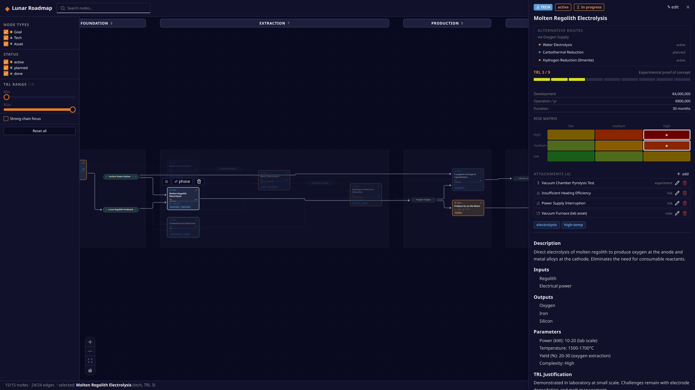

# Lunar Roadmap

An editable, game-style **tech tree for planning a lunar economy** — phases as era columns, dependencies as a left-to-right flow DAG, and readiness states derived live from the graph. Built as a real planning tool, not a visualization: everything on the canvas can be created, rewired, and rearranged.



## Features

- **Era-column layout** — phases are first-class, editable entities (rename, reorder, recolor, add, delete) rendered as columns with sticky headers. Nodes are placed by ELK's layered algorithm (running in a web worker) with stable relayouts while you edit.
- **Flow DAG** — one dependency relation: `source feeds target`, always pointing in flow direction. Edges follow ELK's orthogonal routes like a circuit diagram.
- **Derived readiness** — every node is *Blocked*, *Ready*, *In progress*, or *Done*, computed from the graph: techs and goals need **all** of their inputs done, assets are satisfied by **any one** producer. Nothing is stored — rearrange the graph and the states follow.
- **Derived alternatives** — producers feeding the same asset are alternative routes by definition; the detail panel lists them automatically.
- **Full editing UX** — drag between nodes to connect, drop a connection on empty canvas to create a prefilled node, click an edge label to change or delete it, drag edge endpoints to rewire, drag a node into another column to change its phase, right-click menus, undo/redo (`Ctrl+Z` / `Ctrl+Shift+Z`).
- **Rich nodes** — TRL progress, costs, budgets, deadlines, tags, markdown bodies, and attachments (risks with a probability×impact matrix, experiments, evidence, people, orgs, funding, notes).
- **Selection chain focus** — selecting a node highlights its full upstream + downstream dependency chain and fades the rest.
- **Always saved** — every change is autosaved to the browser's localStorage, so closing the tab is always safe. Export/import the roadmap as JSON, reset to the demo, or start from a blank scaffold via the file menu (works in every browser).

## Quick start

```bash
npm install
npm run dev        # → http://localhost:5173
```

Production build (static, deployable on any web server):

```bash
npm run build      # → dist/
```

## Data model

The graph is a single JSON document (`src/data/graph.json` ships as the demo seed):

| Concept | Values |
|---|---|
| Node types | `goal` · `tech` · `asset` |
| Relations | `flow` (source feeds target) · `related` |
| Statuses | `planned` · `active` · `done` |
| Phases | ordered, colored columns; nodes reference them by id |
| Attachments | `risk` · `assumption` · `evidence` · `experiment` · `person` · `organization` · `funding` · `note` |

Readiness and alternatives are never stored — see `src/derived.ts`. Files written by older versions of the schema are migrated transparently on open (`src/migrate.ts`).

## Stack

React 19 · TypeScript · [React Flow](https://reactflow.dev) (@xyflow/react) · [ELK](https://eclipse.dev/elk/) (elkjs, layered + partitioning) · zustand + zundo · Tailwind + shadcn/ui · Vite

## Roadmap

- Local-first persistence with Yjs (IndexedDB, `Y.UndoManager`)
- Real-time multiplayer (shared rooms, presence)

## License

MIT
